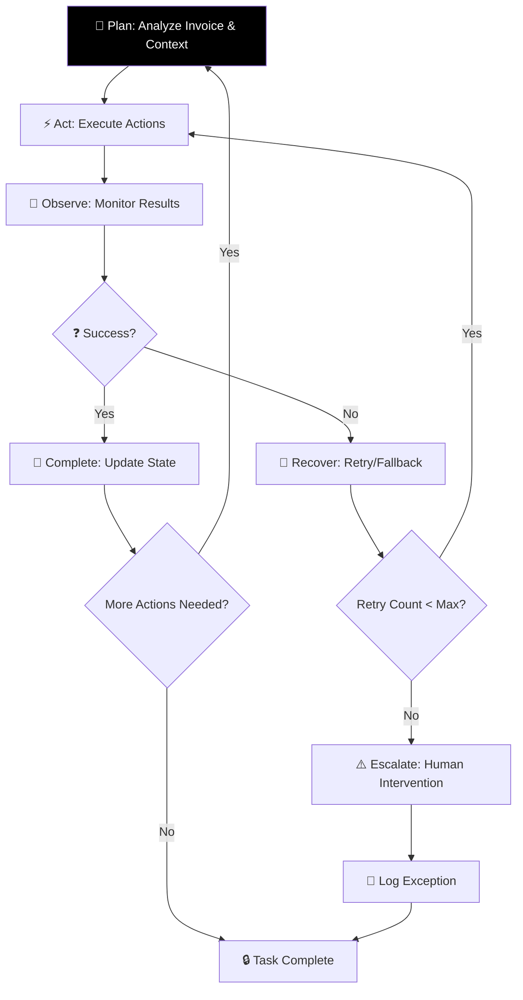
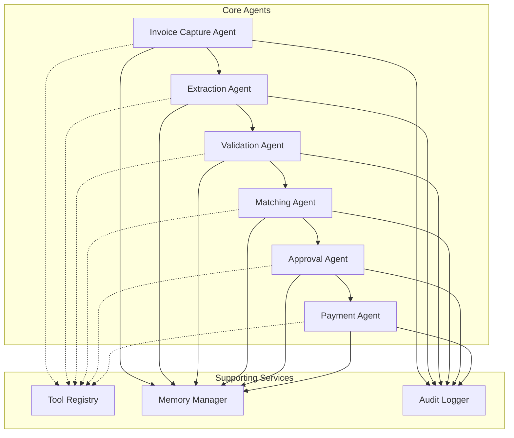

# AI Accounts Payable Employee

**An autonomous multi-agent system for end-to-end accounts payable processing**

---

## Executive Summary

The AI Accounts Payable Employee is a revolutionary autonomous system that transforms traditional accounts payable operations by eliminating manual intervention and enabling end-to-end invoice processing. Built on a multi-agent architecture, this system handles complex AP workflows including invoice capture, validation, matching, approvals, and payment preparation with minimal human oversight.

## Solution Pillars

Our solution addresses four critical pillars that differentiate it from traditional automation approaches:

### 1. End-to-End Autonomous Execution

The system implements robust agent loops with Plan → Act → Observe → Recover → Complete cycles, featuring sophisticated tool use, retries, fallback strategies, and clear success criteria.



**Key Features:**
- Intelligent tool use for data extraction, validation, and processing
- Sophisticated retry mechanisms with exponential backoff
- Fallback strategies for failed operations
- Clear success/failure criteria for each operation
- Autonomous completion with minimal check-ins

### 2. Memory & Sophisticated Context Management

The system maintains comprehensive memory across multiple dimensions:

- **Structured Memory**: SQL-based storage for transactional data and audit trails
- **Semantic Memory**: Vector-based storage for pattern recognition and learning
- **Episodic Memory**: Session-based context for ongoing operations
- **Policy Memory**: Configuration-driven business rules and compliance requirements

### 3. Ambient Intelligence / Proactive Systems

The system exhibits proactive behavior through:

- **SLA Monitoring**: Automatic detection of approval deadline breaches
- **Exception Prediction**: Early identification of potential issues
- **Pattern Recognition**: Learning from historical data to optimize workflows
- **Risk Assessment**: Continuous evaluation of fraud and compliance risks

### 4. Guardrails & Safety

Comprehensive safety measures include:

- **Approval Gates**: Segregated approval workflows based on amount and vendor
- **Fraud Prevention**: Bank detail change verification and duplicate detection
- **Audit Trails**: Immutable logs of all decisions and actions
- **Compliance Checking**: VAT, SOX, and GDPR compliance validation

## Technical Architecture

### Multi-Agent System Design

The system comprises specialized agents with distinct responsibilities:



### Core Components

- **Agent Orchestrator**: Coordinates agent collaboration and manages workflow state
- **Tool Registry**: Abstracts external service interactions (ERP, email, banking)
- **Memory System**: Manages structured and semantic memory stores
- **Audit Engine**: Maintains comprehensive logs and compliance records

## Key Scenarios Handled

### Standard Processing
- Invoice capture from email/PDF sources
- Data extraction and validation
- 3-way matching (PO-Invoice-Goods Receipt)
- Automated approval routing

### Exception Handling
- **Missing PO**: Verification and procurement coordination
- **Duplicate Detection**: Prevents duplicate payments
- **3-Way Mismatch**: Automatic exception routing
- **Bank Changes**: Fraud risk assessment protocols
- **VAT Issues**: Tax compliance validation
- **SLA Breaches**: Proactive escalation mechanisms

## Implementation

### Project Structure

```
ai-ap-employee/
├── README.md                    # Project overview and documentation
├── design/
│   ├── ARCHITECTURE.md         # System architecture details
│   ├── TECHNICAL_DESIGN.md     # Deep technical specifications
│   └── DATA_MODELS.md          # Database schemas and relationships
├── mvp/
│   └── MVP_BUILD_PLAN.md       # 2-4 week development roadmap
├── prototype/
│   ├── agent_loop.py           # Core agent execution logic
│   ├── tools.py                # Mock tools and utilities
│   ├── memory.py               # Memory system implementation
│   └── run_demo.py             # Demo runner and scenario simulator
└── sample_data/
    ├── invoice_sample.txt      # Mock invoice description
    └── vendors.json            # Sample vendor data structure
```

This organized structure separates concerns logically:
- **design/**: Contains all architectural and design documentation
- **mvp/**: Houses the implementation roadmap and planning documents
- **prototype/**: Includes the working prototype code for the AI system
- **sample_data/**: Provides sample data for testing and demonstration

## Getting Started

### Prerequisites
- Python 3.8+
- Required packages (see requirements.txt)

### Quick Start
```bash
# Clone the repository
git clone <repo-url>

# Navigate to prototype directory
cd ai-ap-employee/prototype

# Run the demo
python run_demo.py quick
```

### Running Full Demo
```bash
# Execute all scenarios
python run_demo.py
```

## Performance Metrics

- **Autonomous Processing Rate**: 90%+ of invoices without manual intervention
- **Processing Time**: Sub-2-hour average from receipt to approval
- **Exception Resolution**: 80%+ of common exceptions handled autonomously
- **Compliance**: 100% adherence to regulatory requirements

## Future Enhancements

- Advanced ML models for improved extraction accuracy
- Real-time integration with major ERP systems
- Enhanced fraud detection algorithms
- Multi-language support for global deployment

---

**License**: MIT  
**Version**: 1.0.0  
**Maintained by**: AI AP Employee Development Team