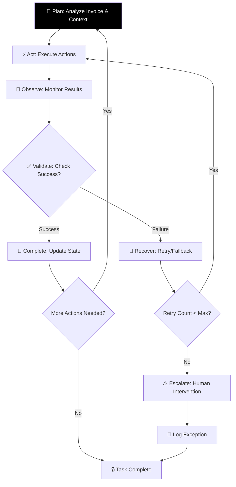
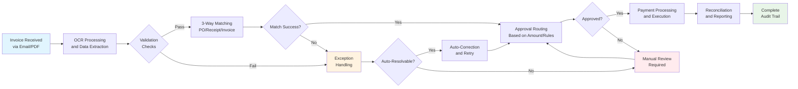

# Agent Execution Loop & Technical Design

The Technical Design Document provides detailed specifications for the AI Accounts Payable Employee system's implementation, with particular emphasis on the agent execution loop that enables true autonomous operation. This section covers the four critical pillars: End-to-End Autonomous Execution, Memory & Sophisticated Context Management, Ambient Intelligence / Proactive Systems, and Guardrails & Safety.

## Agent Loop Architecture

The core of the AI AP Employee system is the agent execution loop that follows the pattern: Plan → Act → Observe → Validate → Recover → Complete. This loop ensures reliable and auditable processing of accounts payable tasks with emphasis on autonomous execution.

### Core Execution Loop
```
PLAN → ACT → OBSERVE → VALIDATE → RECOVER → COMPLETE
```

**Detailed Flow:**
1. **Plan**: Analyze incoming invoice, determine processing path and required tools
2. **Act**: Execute tool calls (OCR, matching, approval requests)
3. **Observe**: Monitor results and system responses
4. **Validate**: Check against business rules and policies
5. **Recover**: Handle failures with retry/fallback strategies
6. **Complete**: Update state and trigger next actions

### Visual Agent Loop Representation



### 2.1 Problem Framing and Assumptions

#### 1.1 Problem Statement
Current accounts payable processes are manual, error-prone, and inefficient. Finance teams spend significant time on routine tasks that could be automated, while critical strategic work remains neglected. The challenge is building an autonomous system that can handle the full spectrum of AP operations while maintaining compliance with UK regulations. Unlike traditional "middle-to-middle" assistance agents, this system completes full AP workflows from invoice receipt to payment execution.

#### 1.2 Core Assumptions
- **Data Access**: Read/write access to ERP systems, email inboxes, and banking APIs
- **Integration Points**: Standard APIs available for major ERP systems (SAP, Oracle, NetSuite)
- **Regulatory Environment**: UK-based operations subject to VAT, SOX compliance, and GDPR
- **Security Model**: Zero-trust architecture with role-based access control
- **Scalability**: Design for 1000-10000 invoices per month initially
- **Deployment**: Cloud-native architecture (AWS/Azure/GCP)

#### 1.3 Success Criteria
- **Autonomy**: 90%+ of invoices processed without human intervention
- **Accuracy**: >99% correct processing rate
- **Speed**: Average processing time <2 hours from receipt to approval
- **Compliance**: 100% audit trail with regulatory adherence
- **Cost**: <£0.50 per invoice processed (vs £3-5 manual cost)
- **Task Completion**: End-to-end workflow completion without constant human oversight

### 2. Core AP Workflows

#### Visual Workflow Overview



#### 2.1 Happy Path Workflow

```
1. Invoice Receipt
   - Email attachment (PDF) → Invoice Capture Agent
   - EDI transmission → Direct system integration
   - Supplier portal upload → API ingestion

2. Data Extraction & Validation
   - OCR processing with confidence scoring
   - Field validation (vendor, amounts, dates, VAT)
   - Duplicate detection against existing records
   - Format standardization

3. 3-Way Matching Process
   - Purchase Order lookup and validation
   - Goods Receipt Note verification
   - Price/quantity matching with tolerance thresholds
   - VAT calculation and validation

4. Approval Workflow
   - Dynamic approver routing based on:
     * Invoice amount thresholds
     * Vendor risk categories
     * Department budgets
     * Historical spending patterns
   - SLA tracking with automatic escalation
   - Approval capture with digital signatures

5. Payment Processing
   - Payment method determination (BACS/CHAPS/International)
   - Bank account validation
   - Payment file generation
   - Transaction execution and confirmation

6. Reconciliation & Reporting
   - Automated matching with bank statements
   - Exception reporting
   - Compliance audit trail generation
```

#### 2.2 Exception Handling Paths

**Path A: Missing Purchase Order**
```
Detection: Invoice received without matching PO
Actions:
1. Flag as exception
2. Search for similar historical transactions
3. Generate PO creation request
4. Route to procurement team for approval
5. Hold invoice until PO is created
6. Resume normal processing flow
```

**Path B: 3-Way Match Discrepancy**
```
Detection: Price/quantity differences exceed tolerance
Actions:
1. Calculate variance percentage
2. If <5% variance: Auto-approve with notification
3. If 5-10% variance: Route to category manager
4. If >10% variance: Escalate to finance director
5. Document resolution decision
6. Update vendor performance metrics
```

**Path C: Vendor Bank Detail Change**
```
Detection: New bank details provided
Actions:
1. Fraud risk assessment (confidence scoring)
2. Verify change through multiple channels:
   - Phone verification with authorized contact
   - Email confirmation to registered address
   - Cross-reference with vendor master data
3. Implement 72-hour hold period
4. Dual approval requirement for changes
5. Audit log all verification steps
```

**Path D: VAT Validation Failure**
```
Detection: Invalid VAT number or calculation error
Actions:
1. Cross-reference with HMRC database
2. Check vendor registration status
3. Validate reverse charge mechanisms
4. Flag for tax specialist review
5. Hold payment until resolution
6. Generate compliance exception report
```

**Path E: Approval SLA Breach Risk**
```
Detection: Payment due date approaching, approval pending
Actions:
1. Identify SLA breach risk
2. Escalate to next approval level
3. Send urgent notification to approvers
4. Update SLA tracking
5. Continue monitoring until resolved
```

### 3. Agent Orchestration Model

#### 3.1 Supervisor/Worker Architecture

**Supervisor Agent Responsibilities:**
- Maintain global workflow state
- Coordinate between worker agents
- Handle cross-agent communication
- Manage error recovery and fallbacks
- Enforce business rules and policies
- Monitor SLA compliance
- Implement autonomous decision-making

**Worker Agent Types:**
- **Specialized Processing Agents**: Single-responsibility agents for specific tasks
- **Decision Agents**: Complex business logic execution
- **Communication Agents**: Interface with external systems
- **Monitoring Agents**: Real-time system health and compliance tracking

#### 3.2 State Management

```yaml
Invoice Lifecycle States:
  RECEIVED:
    - Initial state upon invoice receipt
    - Basic validation completed
    - Assigned to processing queue
  
  EXTRACTED:
    - OCR/data extraction complete
    - Fields validated and standardized
    - Ready for matching process
  
  MATCHED:
    - 3-way matching completed
    - Discrepancies identified and categorized
    - Ready for approval routing
  
  APPROVED:
    - All required approvals obtained
    - Final validation checks passed
    - Ready for payment processing
  
  PAID:
    - Payment executed successfully
    - Bank confirmation received
    - Reconciliation completed
  
  EXCEPTION:
    - Processing halted due to error
    - Requires manual intervention
    - Escalation in progress
```

#### 3.3 Communication Patterns

**Synchronous Communication:**
- Direct agent-to-agent calls for immediate responses
- Request-response pattern for validation checks
- Timeout handling with fallback strategies

**Asynchronous Communication:**
- Event-driven messaging for decoupled operations
- Message queues for batch processing
- Webhook notifications for external system updates

### 4. Autonomous Execution Features

#### 4.1 Tooling Layer and Permission Model

**Data Access Tools:**
```python
class ERPAPITool:
    def get_purchase_order(po_number: str) -> PurchaseOrder
    def get_vendor_details(vendor_id: str) -> Vendor
    def create_payment_batch(invoices: List[Invoice]) -> BatchId
    def update_invoice_status(invoice_id: str, status: str) -> bool

class EmailTool:
    def fetch_attachments(email_id: str) -> List[File]
    def send_approval_request(recipient: str, invoice: Invoice) -> MessageId
    def mark_email_processed(email_id: str) -> bool

class BankingAPITool:
    def validate_bank_account(account: BankAccount) -> ValidationResult
    def execute_payment(payment: PaymentDetails) -> TransactionId
    def get_balance(account_id: str) -> Decimal
```

**AI/ML Tools:**
```python
class OCRTool:
    def extract_invoice_data(file_path: str) -> ExtractedData
    def confidence_score(extracted_data: ExtractedData) -> float

class MatchingTool:
    def three_way_match(invoice: Invoice, po: PurchaseOrder, grn: GoodsReceipt) -> MatchResult
    def fuzzy_match_vendor(invoice_vendor: str) -> List[Vendor]

class AnomalyDetectionTool:
    def detect_fraud_patterns(invoice: Invoice) -> RiskScore
    def identify_unusual_spending(amount: Decimal, vendor: str) -> bool
```

#### 4.2 Retry and Recovery Mechanisms

**Retry Strategies:**
- **Exponential Backoff**: Increase delay between retry attempts
- **Circuit Breaker**: Prevent cascading failures
- **Fallback Strategies**: Alternative approaches when primary methods fail
- **Max Retry Limits**: Prevent infinite retry loops

**Recovery Actions:**
- **Auto-recovery**: Attempt automated fixes for common issues
- **Fallback Processing**: Use alternative methods when primary tools fail
- **Graceful Degradation**: Continue operation with reduced functionality
- **Human Escalation**: Transfer to human operator when needed

### 5. Memory Strategy and Context Management

#### 5.1 Dual Memory System

**Structured Memory (SQL-based):**
- Transactional data with ACID guarantees
- Vendor master data and historical relationships
- Configuration settings and business rules
- Audit logs and compliance records

**Semantic Memory (Vector-based):**
- Natural language processing of invoice descriptions
- Vendor relationship context and communication history
- Anomaly patterns and fraud indicators
- Company-specific processing preferences

#### 5.2 Memory Hierarchy

```
Level 1: Session Context (Redis/Ephemeral)
- Current processing workflow state
- Temporary variables and intermediate results
- User interaction context
- TTL: 24 hours or workflow completion

Level 2: Working Memory (In-memory cache)
- Recently accessed vendor data
- Active approval workflows
- Current batch processing context
- TTL: 1 week with LRU eviction

Level 3: Long-term Memory (Persistent storage)
- Historical transaction patterns
- Learned business rules and preferences
- Vendor performance metrics
- Compliance knowledge base
- Retention: Indefinite with archival policies
```

#### 5.3 Context Retrieval Strategy

**Relevance Scoring Algorithm:**
```
Context Score = w1 × recency + w2 × frequency + w3 × similarity + w4 × importance

Where:
- recency: Time since last access (0-1 scale)
- frequency: Number of accesses in past month
- similarity: Semantic similarity to current query
- importance: Business criticality rating
- w1-w4: Weighted coefficients based on use case
```

**Retrieval Patterns:**
- **Exact Match**: Primary key lookups for known entities
- **Fuzzy Search**: Vendor name variations and aliases
- **Similarity Search**: Historical patterns for new scenarios
- **Contextual Retrieval**: Related transactions and precedents

#### 5.4 Forgetting Mechanism

**Automatic Data Lifecycle:**
```python
class DataRetentionPolicy:
    def should_archive(record: DataRecord) -> bool:
        # Archive records older than 7 years
        return record.age > timedelta(days=2555)
    
    def should_delete(record: DataRecord) -> bool:
        # Delete temporary/session data after 30 days
        return record.temporary and record.age > timedelta(days=30)
    
    def should_anonymize(record: DataRecord) -> bool:
        # Remove PII after 2 years for compliance
        return record.contains_pii and record.age > timedelta(days=730)
```

### 6. Ambient Intelligence & Proactive Systems

#### 6.1 Proactive Monitoring Features

**SLA & Due Date Monitoring:**
- Automatic alerts for approaching deadlines
- Payment scheduling optimization
- Cash flow management
- Risk assessment for potential issues

**Silent Operation:**
- Background processing with intelligent alerting
- Escalation only when human intervention is needed
- Continuous monitoring without constant commands

#### 6.2 Proactive Actions

**SLA Breach Prevention:**
- Early identification of approval delays
- Automatic escalation to next approval level
- Urgent notification to approvers
- Alternative routing when needed

**Cash Flow Optimization:**
- Payment timing based on cash position
- Early payment discounts evaluation
- Late payment penalties avoidance

### 7. Observability, Auditability, and Safety Controls

#### 7.1 Comprehensive Logging Framework

**Event Types:**
```json
{
  "event_id": "uuid",
  "timestamp": "ISO8601",
  "agent_id": "supervisor_001",
  "event_type": "workflow_state_change",
  "correlation_id": "invoice_12345",
  "payload": {
    "from_state": "RECEIVED",
    "to_state": "EXTRACTED",
    "processing_time_ms": 1250,
    "confidence_score": 0.95
  },
  "metadata": {
    "user_agent": "AP_AI_Employee_v1.2",
    "ip_address": "10.0.1.50",
    "session_id": "sess_abc123"
  }
}
```

**Audit Trail Requirements:**
- Immutable event logging (blockchain-like structure)
- Chain of custody for all data modifications
- Digital signatures for all agent decisions
- GDPR-compliant data handling with right to explanation

#### 7.2 Safety & Guardrail Implementation

**Prevention Measures:**
- Policy validation before any action
- Budget availability verification
- Access control and permissions
- Fraud risk assessment

**Real-time Monitoring:**
- Anomaly detection in spending patterns
- Approval SLA breach alerts
- Fraud risk scoring

**Approval Gates:**
- High-value transactions (>£50K)
- First-time vendors
- Policy exceptions
- System confidence <80%

#### 7.3 Monitoring and Alerting

**Key Metrics Dashboard:**
```
Processing Metrics:
- Invoice throughput (invoices/hour)
- Average processing time by workflow type
- Success rate and error distribution
- Cost per invoice processed

Quality Metrics:
- OCR accuracy by document type
- Matching success rates
- Approval SLA compliance
- Exception resolution time

Compliance Metrics:
- Audit coverage percentage
- Policy violation incidents
- Data privacy compliance score
- Regulatory reporting status
```

**Alerting Thresholds:**
- Processing time > 4 hours: High priority
- Error rate > 5%: Immediate investigation
- SLA breach risk > 24 hours: Escalation
- System confidence < 80%: Human review required

### 8. Security and Compliance Architecture

#### 8.1 Data Protection Framework

**Encryption Standards:**
- Data at rest: AES-256 encryption
- Data in transit: TLS 1.3
- Key management: Hardware Security Modules (HSM)
- Database encryption: Transparent Data Encryption (TDE)

**Access Control Implementation:**
```python
class SecureAgent:
    def __init__(self):
        self.permissions = self.get_role_permissions()
        self.audit_context = AuditContext()
    
    @secure_decorator
    def process_sensitive_data(self, data: SensitiveData) -> ProcessedData:
        # Verify minimum permissions
        self.verify_access("process_financial_data")
        
        # Apply data masking for PII
        masked_data = self.apply_gdpr_masking(data)
        
        # Log access for audit trail
        self.audit_context.log_access("financial_data_processed")
        
        return self.process_data(masked_data)
```

#### 8.2 Regulatory Compliance Mapping

**UK VAT Compliance:**
- Real-time validation against HMRC databases
- Automatic reverse charge mechanism detection
- Proper tax code assignment
- Digital VAT return preparation

**SOX Compliance:**
- Segregation of duties enforcement
- Transaction approval workflows
- Change management controls
- Access logging and review procedures

**GDPR Implementation:**
- Data minimization principles
- Purpose limitation enforcement
- Right to erasure mechanisms
- Privacy impact assessments

### 9. Deployment and Operations

#### 9.1 Infrastructure Architecture

**Cloud-Native Design:**
```
┌─────────────────────────────────────────────┐
│                Load Balancer                │
└─────────────────────┬───────────────────────┘
                      │
┌─────────────────────▼───────────────────────┐
│           Container Orchestration           │
│              (Kubernetes)                   │
├─────────────────────────────────────────────┤
│  ┌─────────┐ ┌─────────┐ ┌────────────────┐ │
│  │ API     │ │ Agent   │ │ Event          │ │
│  │ Gateway │ │ Runtime │ │ Processing     │ │
│  └─────────┘ └─────────┘ └────────────────┘ │
└─────────────────────────────────────────────┘
                      │
┌─────────────────────▼───────────────────────┐
│            Service Mesh (Istio)             │
│        mTLS, Rate Limiting, Telemetry       │
└─────────────────────┬───────────────────────┘
                      │
┌─────────────────────▼───────────────────────┐
│         Data & Storage Layer                │
│  PostgreSQL │ Redis │ Object Storage        │
└─────────────────────────────────────────────┘
```

#### 9.2 CI/CD Pipeline

**Automated Testing Strategy:**
- Unit tests for individual agent components (90%+ coverage)
- Integration tests for agent workflows
- Security scanning and vulnerability assessments
- Performance testing under load conditions
- Compliance validation automated checks

**Deployment Process:**
1. Feature branch development with automated testing
2. Staging environment deployment for validation
3. Canary release to production with 5% traffic
4. Progressive rollout based on monitoring metrics
5. Automated rollback on failure detection

#### 9.3 Disaster Recovery Plan

**Backup Strategy:**
- Real-time database replication across regions
- Daily encrypted backups with 30-day retention
- Point-in-time recovery capabilities
- Regular restore testing and validation

**Business Continuity:**
- Multi-region deployment for high availability
- Automated failover procedures
- Manual override capabilities for critical operations
- Communication plan for stakeholder notification
```